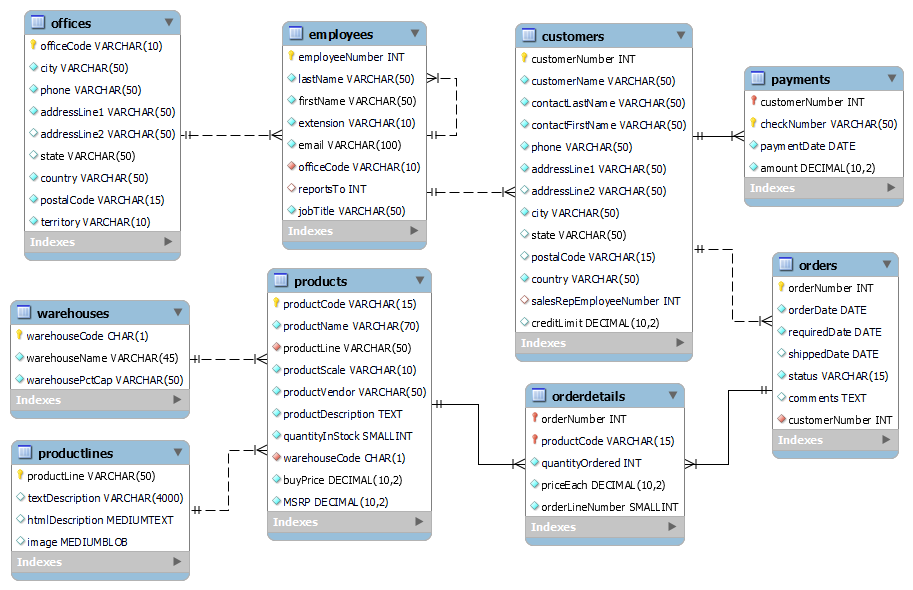

# Warehouse Inventory Analysis Project
Coursera Guided Project: https://www.coursera.org/projects/showcase-analyze-data-model-car-database-mysql-workbench

## Project Scenario
Mint Classics Company, a retailer of classic model cars and other vehicles, is looking at closing one of their storage facilities.

To support a data-based business decision, they are looking for suggestions and recommendations for reorganizing or reducing inventory, while still maintaining timely service to their customers. For example, they would like to be able to ship a product to a customer within 24 hours of the order being placed.

## Project Objectives
1. Explore products currently in inventory.
2. Determine important factors that may influence inventory reorganization/reduction.
3. Provide analytic insights and data-driven recommendations.

## Skills
SQL, Data Visualisation

## Tools Used
MySQL Workbench (for querying data), Tableau (for visualisation of the warehouse inventory)

## Approach

### Step 1: Data preparation
I started the project by initialising a new MySQL connection named "Mint Classics Company". Then, after the required database was created and populated using [the provided SQL scripts by Coursera](mintclassicsDB.sql), it was imported to the workbench to begin analysis.

The EER diagram representing the relationship between the tables is generated as follows:

### Step 2: Exploratory Data Analysis

#### 2.1. Examining the dataset
I wanted to understand the variables in each tables of the dataset, hence using the `DESCRIBE` command to examine the tables. The query results were exported and merged into [this Excel workbook](DatabaseDescription.xlsx). A screenshot of the workbook:

#### 2.2. Choosing tables for analysis
With the final goal of reducing inventory to close one warehouse, I chose the three tables `warehouses`, `orderdetails`, and `products` as the focus of analysis as they contain useful variables about the warehouse capacity, available products with their respective product lines, and the buying and selling price of each product. The first 5 rows of the tables are shown as follows:

Table `warehouses`:

Table `orderdetails`:

Table `products`:

#### 2.3. Choosing variables for analysis
It could be observed that not all the table columns are useful for the analysis, e.g. table `products`'s `productName` and `productDescription` columns. Thus, I mainly focused on the following columns to perform analysis:

1. Table `warehouses`: `warehouseCode` and `warehousePctCap` (the capacity of the warehouse in %)

2. Table `orderdetails`: `productCode`, `quantityOrdered`, and `priceEach` (the actual selling price of the respective product in the observed order)

3. Table `products`: `productCode`, `productLine`, `quantityInStock`, `warehouseCode`, `buyPrice` (product's buying price), and `MSRP` (short for *manufacturer's suggested retail price*, which is the recommended selling price of a product)

#### 2.4. Checking for missing values
I used the `WHERE` clause to filter the table rows with NULL values and then count the number of such rows. Since the results of the queries were all 0, I concluded that there were no missing values in the focused tables for analysis.

#### 2.5. Investigating the warehouse inventory
Finally, I wanted to see what the warehouse inventory currently looked like, e.g. How many products and product lines are stored in each warehouse? What are the total in-stock quantities? Does any of the warehouses still have much storage space?

The query I performed and its results were:

### Step 3: Warehouse Inventory Analysis
After EDA, I continued to answer some questions:

#### 3.1. What is the warehouse with the highest current capacity?
By answering this question, I could determine which warehouse was storing the most inventory so that the company might need to reduce the amount, either by dropping some products stored there or moving the inventory to other warehouses.

The query I performed and its results were:

As warehouse d has the highest capacity but the lowest number of items stored (its total quantity in stock is even much lower than those of other warehouses), it can be inferred that this is the smallest warehouse of the company. Another noticeable point is that warehouse c's storage is only half full. This result leads us to the question of whether the company should move its inventory in warehouse d to warehouse c in order to accomplish the goal of closing one warehouse.

#### 3.2. What is the real profit of the products in each warehouse?
Next, I wanted to know what the least profitable warehouse was since the answer to such question could show which warehouse the company should consider to close. To calculate the profit of a product, I multiplied the quantity of items ordered (`quantityOrdered`) with the difference between the product's purchase price (`buyPrice`) and its actual selling price (`priceEach`). The result was grouped by `warehouseCode` such that we knew which warehouse the profit came from.

The query I performed and its results were:

From the result, warehouse d generates the least unweighted profit. This is not unexpected considering the warehouse's size.

#### 3.3. What are the product lines stored in the warehouse?
Understanding what product lines and how many product types were stored in the warehouses could help the company assess the feasibility of moving the inventory across the warehouses.

The query I performed and its results were:

It can be seen that each product line is stored in only one specific warehouse regardless of how many product types it comprises. Besides, warehouse d has the fewest products despite storing three product lines. This suggests that moving warehouse d's inventory be easier as the company can divide the products into three parts.

#### 3.4. What are the rates of the products' quantity ordered vs. quantity in stock?
Then, I attempted to measure how fast the products had been moving by comparing their quantity ordered with quantity in stock. The higher the rate, the more likely products in that warehouse were moving. The company may make use of this information to estimate the operational efficiency of the warehouses - a factor to decide which warehouse to remove.

The query I performed and its results were:

From the result, we see that warehouse d has the lowest total order rate, which can be affected by both the number of products stored in the warehouse and how fast they have been moving.

Recalling the result of query *2.5.*, we realise that warehouse d has only 2 products fewer than warehouse a and its quantity in stock is around 60% of warehouse a's. However, the total order rate of warehouse d is nearly 7 times lower than that of warehouse a. This means that the products in warehouse d may be moving a lot lower.

#### 3.5. What are the products that have been undervalued/ not yielded as much profit as expected? What are the products that have not been moving?
Lastly, answering these two questions would help the company determine what products in which warehouse to drop in order to make room for more profitable product storage. If a product's selling price was lower than the MSRP, it was considered undervalued.

The query I performed and its results were:

It is clear that warehouse d has fewest undervalued products, while warehouse b has 37 products that are not profitable as expected. In addition, there exists a product that has not been moving at all in warehouse b as no item of that product was purchased in all the past orders.

## Solution
With the insights gathered from my analysis, I recommend Mint Classic company close warehouse d by moving the inventory to other warehouses.

The company may also drop the non-moving product and adjust the pricing of undervalued ones to increase the warehouse storage and operational efficiency.
